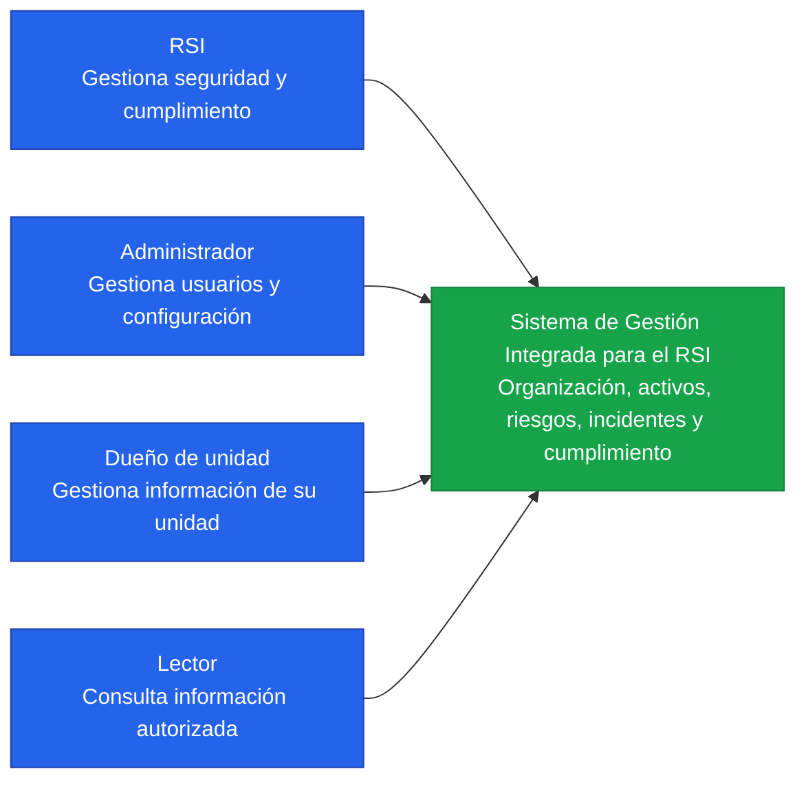
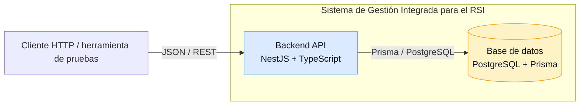
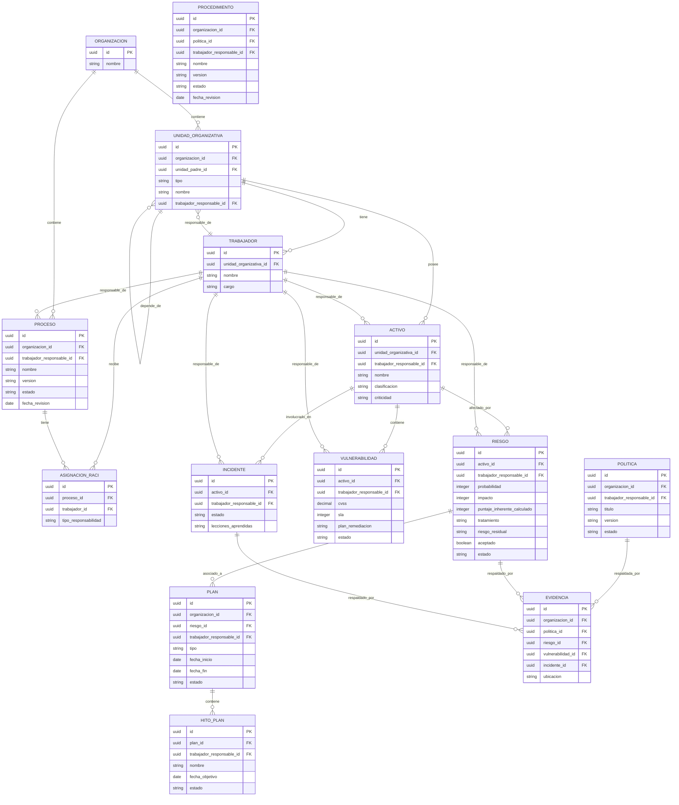

# Arquitectura del sistema

## Control del documento

| Campo | Valor |
|---|---|
| Código | ARQ-C4-02 |
| Versión | 1.0 |
| Fecha | 24/09/2026 |
| Metodología | C4 |
| Estado | En construcción |

## C4 — Diagrama de contexto

El Sistema RSI está construido actualmente como una API backend con PostgreSQL.
Los perfiles que se muestran son actores previstos para la solución; la
autenticación y la interfaz web todavía están pendientes.

### Alcance del diagrama

- El sistema concentra la lógica de gestión y cumplimiento en una API REST.
- La interfaz de navegador está prevista, pero no está implementada aún.

## C4 — Diagrama de contenedores

Este nivel muestra las partes principales que forman la aplicación web y cómo se comunican.

### Lectura simple del flujo

1. Un cliente HTTP invoca una ruta REST bajo `/api/v1`.
2. El backend aplica la lógica del módulo correspondiente.
3. Prisma consulta o modifica los datos en PostgreSQL.
4. La API devuelve una respuesta JSON al cliente.

## C4 — Diagrama de componentes

El backend se organiza como un monolito modular. Cada módulo concentra sus
controladores, servicios y DTOs, y utiliza Prisma para acceder a PostgreSQL.

| Componente | Responsabilidad | Estado |
|---|---|---|
| Organización | Organizaciones, unidades, trabajadores, procesos y RACI | Implementado |
| Seguridad | Activos, riesgos, vulnerabilidades e incidentes | Implementado |
| Cumplimiento | Políticas, procedimientos, planes y evidencias | Implementado |
| Búsqueda | Búsqueda global y filtros por unidad, estado y severidad | Implementado en API |
| KPI | Resumen, indicadores configurables, metas y mediciones históricas | Implementado; fórmulas disponibles mediante catálogo |
| Prisma | Persistencia y migraciones de PostgreSQL | Implementado |
| Docker Compose | Ejecución local de PostgreSQL y volumen persistente | Implementado; sin respaldo automático |
| Documentación de seguridad | Política, procedimientos de incidentes y vulnerabilidades, plan de continuidad | Redactados; requieren validación/aprobación operativa |
| Exportadores | Generación de documentos MCU, BCU, ISO, URCDP y COBIT | Pendiente |
| Autenticación y auditoría | Identidad, permisos y trazabilidad | Pendiente |
| Frontend y dashboard | Interfaz web y visualización de KPI | Pendiente |
| SIEM | Recepción y análisis centralizado de logs | Pendiente |

## C4 — Diagrama de código

Los archivos principales de los módulos implementados son:

| Componente | Archivos principales |
|---|---|
| Organización | `backend/src/organizacion/organizacion.controller.ts`, `organizacion.service.ts` |
| Seguridad | `backend/src/seguridad/seguridad.controller.ts`, `seguridad.service.ts` |
| Cumplimiento | `backend/src/cumplimiento/cumplimiento.controller.ts`, `cumplimiento.service.ts` |
| Búsqueda | `backend/src/busqueda/busqueda.controller.ts`, `busqueda.service.ts` |
| KPI | `backend/src/kpi/kpi.controller.ts`, `kpi.service.ts` |
| Persistencia | `backend/prisma/schema.prisma`, `backend/src/prisma/prisma.service.ts` |

Los módulos de seguridad incluyen activos, riesgos, vulnerabilidades e
incidentes. El módulo de cumplimiento incluye políticas, procedimientos,
planes y evidencias. Los documentos asociados describen procesos previstos y
no implican que los controles técnicos correspondientes ya estén desplegados.

## Modelo entidad-relación

Este diagrama muestra los datos principales del sistema y sus relaciones. A diferencia de C4, aquí se detallan los responsables, activos, riesgos, planes e incidentes.

## Estado de la arquitectura

### Implementado

- Backend NestJS con API REST versionada en `/api/v1`.
- PostgreSQL con Prisma y migraciones.
- Módulos de organización, seguridad y cumplimiento.
- KPI: resumen existente, catálogo de fórmulas, configuración de indicadores,
  metas y captura/consulta de mediciones históricas.
- Ejecución local de PostgreSQL mediante Docker Compose.
- Volumen persistente local para los datos de PostgreSQL.
- Documentación inicial de política de seguridad, gestión de incidentes,
  gestión de vulnerabilidades y continuidad.

### Planificado o pendiente

- Frontend React + Vite.
- Exportadores de documentos.
- Autenticación, roles, permisos y auditoría.
- Integración con Wazuh.
- Dashboard visual de KPI.
- Respaldos automáticos, copia externa y prueba documentada de restauración.
