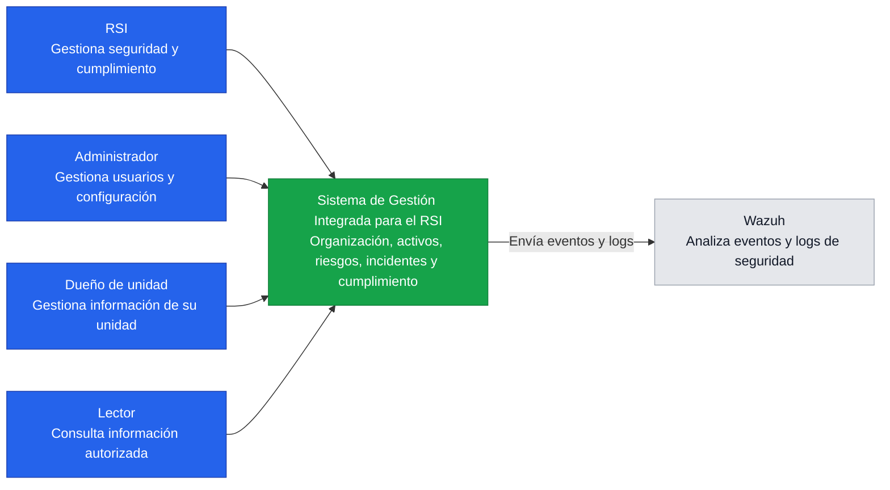
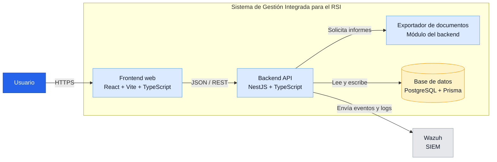
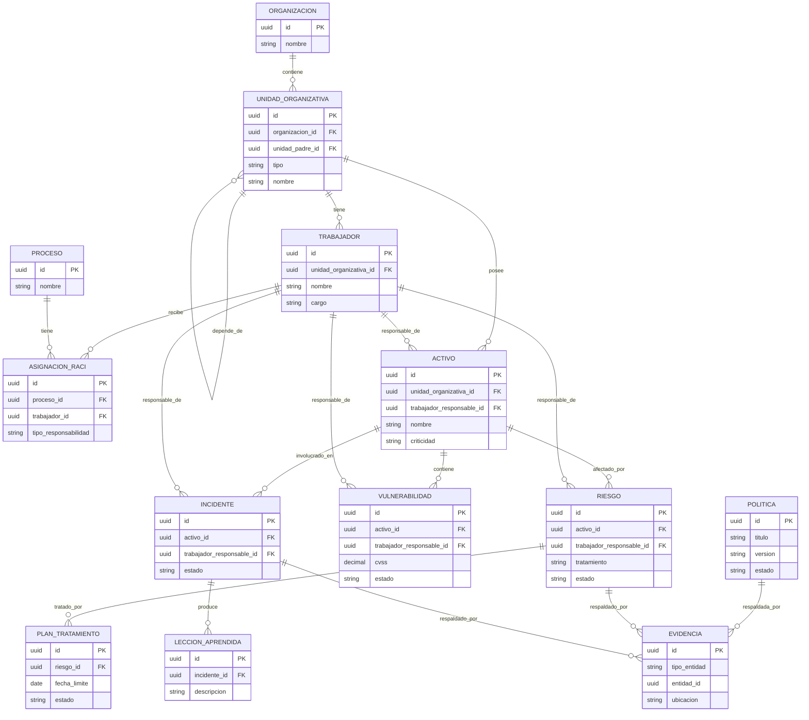

# Arquitectura del sistema

## C4 — Diagrama de contexto

El sistema será utilizado por distintos perfiles de la organización para gestionar seguridad de la información, activos, riesgos, incidentes y cumplimiento.

### Alcance del diagrama

- Los usuarios interactúan con el sistema desde un navegador.
- El sistema RSI concentra la lógica de gestión y cumplimiento.
- Wazuh se considera un sistema externo porque Persona 2 gestionará su integración técnica.

## C4 — Diagrama de contenedores

Este nivel muestra las partes principales que forman la aplicación web y cómo se comunican.

### Lectura simple del flujo

1. El usuario entra a la aplicación mediante el **frontend**.
2. El frontend solicita información al **backend**.
3. El backend aplica la lógica del sistema y consulta **PostgreSQL**.
4. Cuando se solicita un informe, el backend utiliza el **exportador**.
5. Las acciones relevantes generan eventos que se envían a **Wazuh**.

## Modelo entidad-relación

Este diagrama muestra los datos principales del sistema y sus relaciones. A diferencia de C4, aquí se detallan los responsables, activos, riesgos, planes e incidentes.

