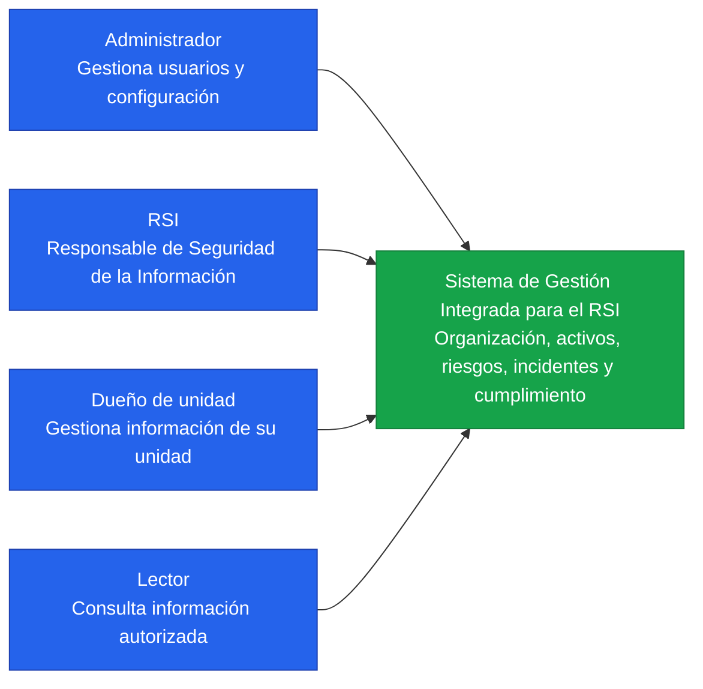
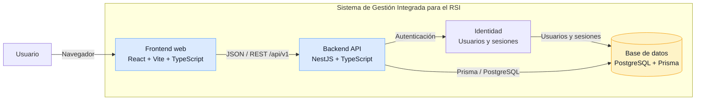
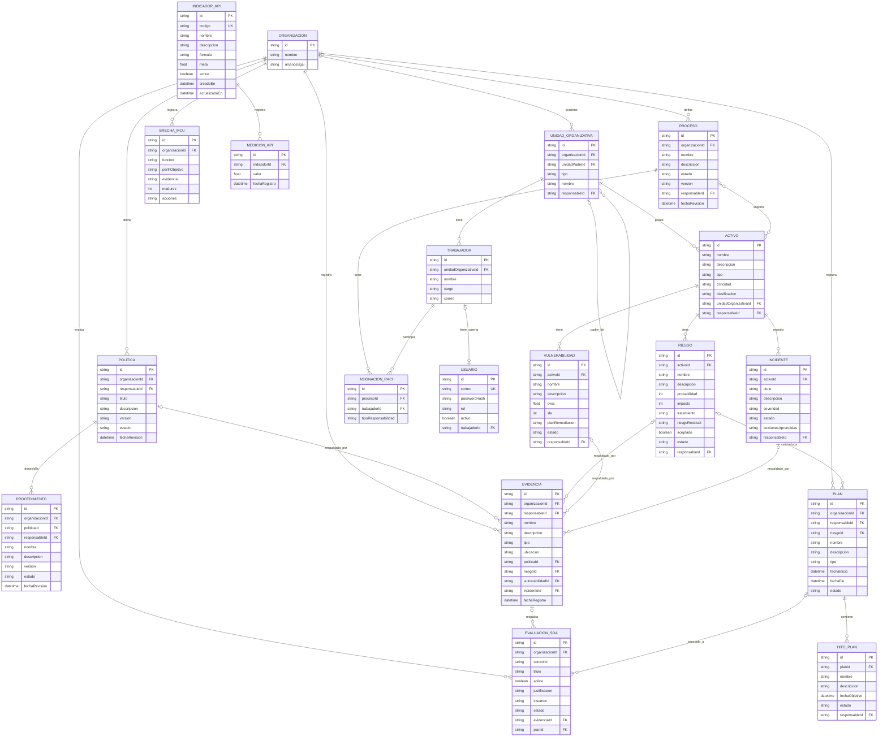

# Arquitectura del sistema

## Control del documento

| Campo | Valor |
|---|---|
| Código | ARQ-C4-02 |
| Versión | 1.8 |
| Fecha | 29/09/2026 |
| Metodología | C4 |
| Estado | En construcción |

## C4 — Diagrama de contexto

El Sistema RSI está construido como una aplicación web con una API backend y
PostgreSQL. La autenticación básica ya está implementada mediante usuarios y
sesiones persistidas. La autorización por roles y la auditoría básica están
implementadas; MFA/TOTP continúa pendiente.

```mermaid
flowchart LR
    Admin[Administrador<br/>Gestiona usuarios y configuración]
    RSI[RSI<br/>Responsable de Seguridad de la Información]
    Dueño[Dueño de unidad<br/>Gestiona información de su unidad]
    Lector[Lector<br/>Consulta información autorizada]
    Sistema[Sistema de Gestión Integrada para el RSI<br/>Organización, activos, riesgos, incidentes y cumplimiento]
    Admin --> Sistema
    RSI --> Sistema
    Dueño --> Sistema
    Lector --> Sistema

    classDef actor fill:#2563eb,color:#fff,stroke:#1e40af
    classDef system fill:#16a34a,color:#fff,stroke:#15803d
    class Admin,RSI,Dueño,Lector actor
    class Sistema system
```

### Alcance del diagrama

- El sistema concentra la lógica de gestión y cumplimiento en una API REST.
- La interfaz React expone los módulos implementados y ajusta los menús según
  el rol autenticado.
- Los perfiles del diagrama representan usuarios con distintos roles de acceso.
- El backend aplica autenticación, roles, modo lectura y alcance por unidad u
  organización según el usuario autenticado.

## C4 — Diagrama de contenedores

Este nivel muestra las partes principales que forman la aplicación web y cómo se comunican.

```mermaid
flowchart LR
    Usuario[Usuario]

    subgraph Sistema[ Sistema de Gestión Integrada para el RSI ]
        Frontend[Frontend web<br/>React + Vite + TypeScript]
        Backend[Backend API<br/>NestJS + TypeScript]
        Identidad[Identidad<br/>Usuarios y sesiones]
        BD[(Base de datos<br/>PostgreSQL + Prisma)]
    end

    Usuario -->|Navegador| Frontend
    Frontend -->|JSON / REST /api/v1| Backend
    Backend -->|Autenticación| Identidad
    Identidad -->|Usuarios y sesiones| BD
    Backend -->|Prisma / PostgreSQL| BD

    classDef app fill:#dbeafe,color:#111827,stroke:#60a5fa
    classDef data fill:#fef3c7,color:#111827,stroke:#f59e0b
    class Frontend app
    class Backend app
    class BD data
```

### Lectura simple del flujo

1. El usuario interactúa con el frontend desde el navegador.
2. El frontend invoca rutas REST bajo `/api/v1` (en desarrollo, Vite reenvía
   `/api` al backend local).
3. El backend aplica la lógica del módulo correspondiente.
4. Prisma consulta o modifica los datos en PostgreSQL.
5. La API devuelve JSON al frontend.

## C4 — Diagrama de componentes

El backend se organiza como un monolito modular. Cada módulo concentra sus
controladores, servicios y DTOs, y utiliza Prisma para acceder a PostgreSQL.

| Componente | Responsabilidad | Estado |
|---|---|---|
| Organización | Organizaciones, unidades, trabajadores, procesos y RACI | Implementado |
| Seguridad | Activos, riesgos, vulnerabilidades e incidentes | Implementado |
| Cumplimiento | Políticas, procedimientos, planes y evidencias | Implementado |
| Búsqueda | Búsqueda global y filtros por unidad, estado y severidad | Implementado en API |
| KPI | Resumen, indicadores configurables, metas y mediciones históricas | Implementado; fórmulas disponibles mediante catálogo |
| Exportaciones | Inventario de activos y SoA ISO | Implementado en API; otras exportaciones pendientes |
| Prisma | Persistencia y migraciones de PostgreSQL | Implementado |
| Docker Compose | Ejecución local de PostgreSQL y volumen persistente | Implementado; sin respaldo automático |
| Documentación de seguridad | Política, procedimientos de incidentes y vulnerabilidades, plan de continuidad | Redactados; requieren validación/aprobación operativa |
| Autenticación | Registro, login, hash scrypt y sesiones expirables | Implementado; requiere endurecimiento y MFA |
| Autorización y auditoría | Roles, permisos, alcance por unidad y trazabilidad | Implementado; MFA/TOTP pendiente |
| Frontend y dashboard | Consulta del organigrama implementada; otras pantallas y dashboard KPI | Parcial |
| SIEM | Recepción y análisis centralizado de logs | Pendiente |

## C4 — Diagrama de código

Los archivos principales de los módulos implementados son:

| Componente | Archivos principales |
|---|---|
| Organización | `backend/src/organizacion/organizacion.controller.ts`, `organizacion.service.ts` |
| Seguridad | `backend/src/seguridad/seguridad.controller.ts`, `seguridad.service.ts` |
| Cumplimiento | `backend/src/cumplimiento/cumplimiento.controller.ts`, `cumplimiento.service.ts` |
| Búsqueda | `backend/src/busqueda/busqueda.controller.ts`, `busqueda.service.ts` |
| KPI | `backend/src/kpi/kpi.controller.ts`, `kpi.service.ts` |
| Exportaciones | `backend/src/exportaciones/exportaciones.controller.ts`, `exportaciones.service.ts`, `soa.service.ts` |
| Persistencia | `backend/prisma/schema.prisma`, `backend/src/prisma/prisma.service.ts` |
| Identidad | `backend/src/auth/auth.controller.ts`, `auth.service.ts`, `auth.module.ts` |
| Frontend | `frontend/src/app/App.tsx`, `frontend/src/features/organizacion/` |

Los módulos de seguridad incluyen activos, riesgos, vulnerabilidades e
incidentes. El módulo de cumplimiento incluye políticas, procedimientos,
planes y evidencias. Los documentos asociados describen procesos previstos y
no implican que los controles técnicos correspondientes ya estén desplegados.

## Modelo entidad-relación

El esquema reúne las 20 entidades y sus atributos definidos en
`backend/prisma/schema.prisma`. Las flechas muestran los vínculos estructurales
principales; se omiten las flechas de responsables y las pertenencias que ya
se deducen por otro camino. Los campos con `FK` sí existen en Prisma aunque
alguna de sus flechas no se dibuje aquí. La nulabilidad y las restricciones
exactas se consultan en el schema.

```mermaid
erDiagram
    ORGANIZACION ||--o{ UNIDAD_ORGANIZATIVA : contiene
    UNIDAD_ORGANIZATIVA o|--o{ UNIDAD_ORGANIZATIVA : padre_de
    UNIDAD_ORGANIZATIVA ||--o{ TRABAJADOR : tiene
    UNIDAD_ORGANIZATIVA ||--o{ ACTIVO : posee
    ACTIVO ||--o{ RIESGO : tiene
    ACTIVO ||--o{ VULNERABILIDAD : tiene
    ACTIVO ||--o{ INCIDENTE : registra
    ORGANIZACION o|--o{ PROCESO : define
    PROCESO ||--o{ ASIGNACION_RACI : tiene
    TRABAJADOR ||--o{ ASIGNACION_RACI : participa
    TRABAJADOR o|--o| USUARIO : tiene_cuenta
    ORGANIZACION ||--o{ POLITICA : define
    POLITICA ||--o{ PROCEDIMIENTO : desarrolla
    ORGANIZACION ||--o{ PLAN : registra
    RIESGO o|--o{ PLAN : asociado_a
    PROCESO }o--o{ ACTIVO : soporta
    PLAN ||--o{ HITO_PLAN : contiene
    ORGANIZACION ||--o{ EVIDENCIA : registra
    POLITICA o|--o{ EVIDENCIA : respaldada_por
    RIESGO o|--o{ EVIDENCIA : respaldado_por
    VULNERABILIDAD o|--o{ EVIDENCIA : respaldada_por
    INCIDENTE o|--o{ EVIDENCIA : respaldado_por
    ORGANIZACION ||--o{ EVALUACION_SOA : evalua
    EVIDENCIA o|--o{ EVALUACION_SOA : respalda
    PLAN o|--o{ EVALUACION_SOA : asociado_a
    ORGANIZACION ||--o{ BRECHA_MCU : registra
    INDICADOR_KPI ||--o{ MEDICION_KPI : registra

    ORGANIZACION {
        string id PK
        string nombre
        string alcanceSgsi
    }

    UNIDAD_ORGANIZATIVA {
        string id PK
        string organizacionId FK
        string unidadPadreId FK
        string tipo
        string nombre
        string responsableId FK
    }

    TRABAJADOR {
        string id PK
        string unidadOrganizativaId FK
        string nombre
        string cargo
        string correo
    }

    USUARIO {
        string id PK
        string correo UK
        string passwordHash
        string rol
        boolean activo
        string trabajadorId FK
    }

    PROCESO {
        string id PK
        string organizacionId FK
        string nombre
        string descripcion
        string estado
        string version
        string responsableId FK
        datetime fechaRevision
    }

    ASIGNACION_RACI {
        string id PK
        string procesoId FK
        string trabajadorId FK
        string tipoResponsabilidad
    }

    ACTIVO {
        string id PK
        string nombre
        string descripcion
        string tipo
        string criticidad
        string clasificacion
        string unidadOrganizativaId FK
        string responsableId FK
    }

    RIESGO {
        string id PK
        string activoId FK
        string nombre
        string descripcion
        int probabilidad
        int impacto
        string tratamiento
        string riesgoResidual
        boolean aceptado
        string estado
        string responsableId FK
    }

    VULNERABILIDAD {
        string id PK
        string activoId FK
        string nombre
        string descripcion
        float cvss
        int sla
        string planRemediacion
        string estado
        string responsableId FK
    }

    INCIDENTE {
        string id PK
        string activoId FK
        string titulo
        string descripcion
        string severidad
        string estado
        string leccionesAprendidas
        string responsableId FK
    }

    POLITICA {
        string id PK
        string organizacionId FK
        string responsableId FK
        string titulo
        string descripcion
        string version
        string estado
        datetime fechaRevision
    }

    PROCEDIMIENTO {
        string id PK
        string organizacionId FK
        string politicaId FK
        string responsableId FK
        string nombre
        string descripcion
        string version
        string estado
        datetime fechaRevision
    }

    EVIDENCIA {
        string id PK
        string organizacionId FK
        string responsableId FK
        string nombre
        string descripcion
        string tipo
        string ubicacion
        string politicaId FK
        string riesgoId FK
        string vulnerabilidadId FK
        string incidenteId FK
        datetime fechaRegistro
    }

    PLAN {
        string id PK
        string organizacionId FK
        string responsableId FK
        string riesgoId FK
        string nombre
        string descripcion
        string tipo
        datetime fechaInicio
        datetime fechaFin
        string estado
    }

    HITO_PLAN {
        string id PK
        string planId FK
        string nombre
        string descripcion
        datetime fechaObjetivo
        string estado
        string responsableId FK
    }

    INDICADOR_KPI {
        string id PK
        string codigo UK
        string nombre
        string descripcion
        string formula
        float meta
        boolean activo
        datetime creadoEn
        datetime actualizadoEn
    }

    MEDICION_KPI {
        string id PK
        string indicadorId FK
        float valor
        datetime fechaRegistro
    }

    EVALUACION_SOA {
        string id PK
        string organizacionId FK
        string controlId
        string titulo
        boolean aplica
        string justificacion
        string insumos
        string estado
        string evidenciaId FK
        string planId FK
    }

    BRECHA_MCU {
        string id PK
        string organizacionId FK
        string funcion
        string perfilObjetivo
        string evidencia
        int madurez
        string acciones
    }
```

## Estado de la arquitectura

### Implementado

- Backend NestJS con API REST versionada en `/api/v1`.
- PostgreSQL con Prisma y migraciones.
- Módulos de organización, seguridad y cumplimiento.
- Frontend React con consulta del organigrama y sus unidades.
- Exportación Markdown del inventario de activos y del SoA; la API permite
  registrar evaluaciones SoA y brechas MCU.
- KPI: resumen existente, catálogo de fórmulas, configuración de indicadores,
  metas y captura/consulta de mediciones históricas.
- Ejecución local de PostgreSQL mediante Docker Compose.
- Volumen persistente local para los datos de PostgreSQL.
- Documentación inicial de política de seguridad, gestión de incidentes,
  gestión de vulnerabilidades y continuidad.

### Roles y alcance de datos

| Rol | Alcance y permisos principales |
|---|---|
| `ADMINISTRADOR` | Acceso completo, gestión de usuarios y auditoría. |
| `RSI` | Gestión de seguridad y cumplimiento; sin administración de usuarios. |
| `DUENO_UNIDAD` | Gestión limitada a su organización y unidad asociada. No ve usuarios ni auditoría. |
| `LECTOR` | Solo lectura dentro de su organización y unidad asociada. No puede crear, editar ni eliminar registros. |

La interfaz oculta opciones no autorizadas, pero la protección efectiva se
aplica en el backend mediante guards, validación de alcance y filtros de
consulta. Los identificadores enviados por el cliente no pueden ampliar el
alcance del usuario autenticado.

### Planificado o pendiente

- Pantallas frontend para los módulos restantes y dashboard visual de KPI.
- Exportadores para MCU 5.0, BCU, URCDP y COBIT.
- MFA/TOTP.
- Integración con Wazuh.
- Respaldos automáticos, copia externa y prueba documentada de restauración.
